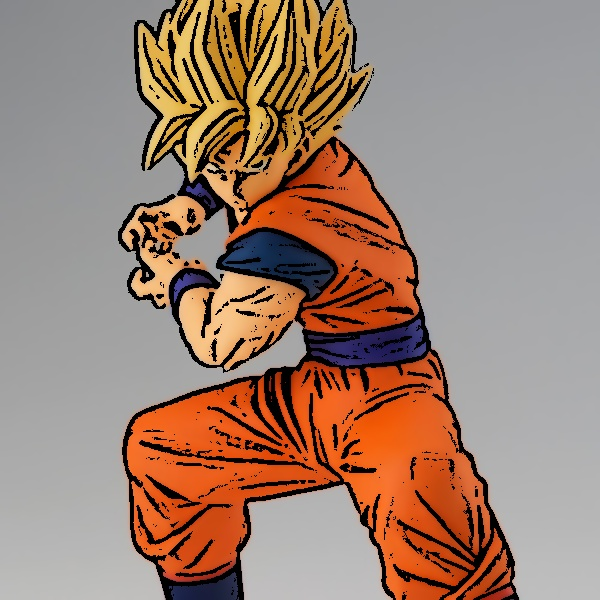
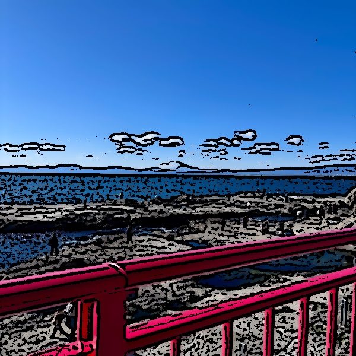

# Cartoon-Render
My cartoon render using OpenCV. You can render a picture as a cartoon style.

## 잘 표현되는 이미지지

## 잘 표현되지 않는 이미지

## 알고리즘의 한계점
- 피규어 사진은 비교적 외곽선을 잘 검출하고 자연스럽게 보임
- 그러나 풍경 사진은 자연스럽지 않은 모습을 보임
- 뚜렷한 경계선이 부족하고 엣지 감지가 잘 안됨 + 색상이 점진적으로 변함
- 명암 대비도 낮아서 경계선이 흐려져 효과가 약함
- 단순한 필터링 만으로는 부족하고 엣지 감지 방식을 보완하고 색상 양자화, 대비 조절등을 추가해야함